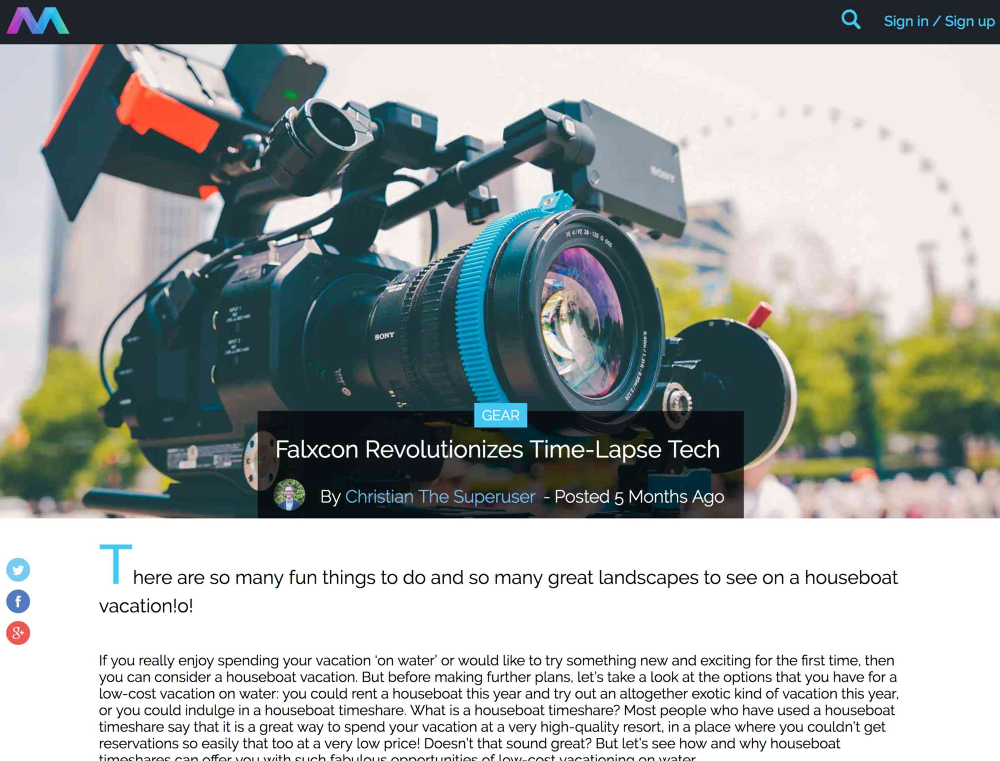

# Digital Monkey - A Tech Blog

**From this version I learnt responsive frontend design and how to use MVC frameworks such as Laravel, Ruby on Rails, etc to quickly develop sites multi-page sites.**

This is a reworked version the my final project in [DM2517 XML for Publishing](https://www.kth.se/student/kurser/kurs/DM2517?l=en). It has been completely rebuilt using Laravel. It was previously built with vanilla PHP and is available in another repo [KTH-XMLForPublishing](https://github.com/chrismessiah/KTH-XMLForPublishing).


### Preview 




### Requirements

* Homebrew
* Node
* Bower
* PHP +7.0
* pdo-pgsql module for PHP
* Grunt-CLI
* Postgresql


#### Installing requirements

```
// Homebrew
$ /usr/bin/ruby -e "$(curl -fsSL https://raw.githubusercontent.com/Homebrew/install/master/install)"

// Node
$ brew install node

// Bower
$ npm install -g bower

// PHP +7.0
$ brew tap homebrew/dupes
$ brew tap homebrew/versions
$ brew tap homebrew/homebrew-php
$ brew install php70

// pdo-pgsql
$ brew install php70-pdo-pgsql

// Grunt-CLI
$ npm install -g grunt-cli

// Postgresql
$ brew install postgresql
```

Remember to change `php5_module`  in `/etc/apache2/httpd.conf` to

```
LoadModule php7_module /usr/local/opt/php70/libexec/apache2/libphp7.so
```

### First-time setup

```
// into cd /my-kth-blog
$ createdb my-kth-blog
$ php artisan migrate
$ bower install
$ npm install
$ composer install

```
